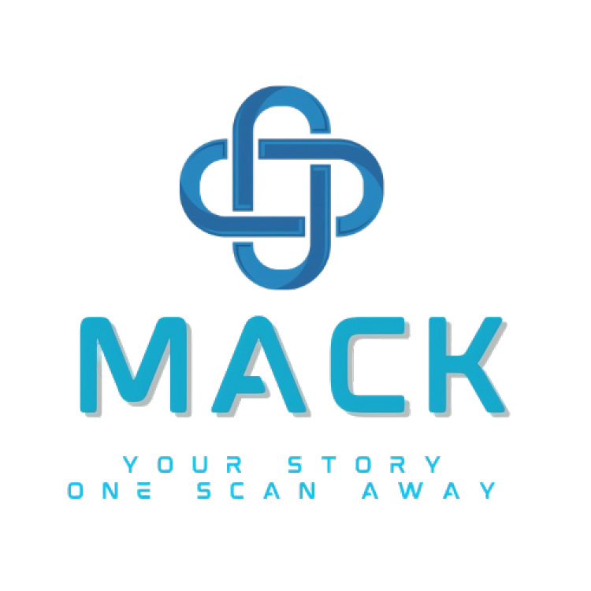

  
  <h1 align="center">MACK: Design your own website
</h1>

## 📢 About
Our mission is to empower students and the broader community to engage with emerging technologies through hands-on learning and creativity.
Created by a team of passionate undergraduate students, MACK stands for Mohfez, Ayesha, Carri, and Keyvan—each bringing a unique perspective to the development of a simple, yet powerful digital identity platform.
## 💡 Project Information
* Difficulty Level: Easy
* Target Audience: 6th Grade – College Students
* Duration of Workshop: 30–60 minutes
* Required Materials: NFC Chip, Mobile App for NFC Chip
* The primary goal of this project is educating others about developing their own digital business card and using NFC technology
## What is TAP?
Technology Ambassoder Program at GGC allows students to build projects using different technologies that have a target to teach others about techonology! 
[GGC TAP](https://www.ggc.edu/academics/schools/school-of-science-and-technology/research-internships-service-learning/technology-ambassador-program/)
## 👥 Team
  
* **M**ohfez Rahman :slightly_smiling_face:
* **A**yesha Syeda &#128153;
* **C**arri Waller &#127872;
* **K**eyvan Shabani &#129497;  
## 🎓 Advisors 
* Dr. Cengiz Gunay
* Dr. Rahaf Barakat
## 📃 Description
MACK is a student-led initiative that introduces participants to emerging technologies through the creation of personalized digital business cards. Using NFC chips, students can easily share key information such as academic background, personal interests, work or project experiences, future goals, and preferred social media platforms. Designed for 6th grade through college students, this project empowers users to enhance their digital presence and networking skills in a hands-on, creative way. By combining accessibility with innovation, MACK provides a modern solution for building and sharing digital identities.

## 📝 Publications:
1. [CCSC:SE Abstract](/documents/CCSC:SE_Abstract.md)
2. CREATE Symposium Poster, Nov 11th (in-person) and 12th (online) from 2-3:15pm, GGC.
## 🔎 Similar Projects
* [TapIn](https://github.com/TAP-GGC/TapIn)
## 👐 Outreach Activites
1. Super Saturday Series (S3), October 12th(Boys) & October 14th(Girls) from 6:30 to 7:30pm, GGC – for middle and high schoolers to promote IT and STEM careers
2. [TAP Expo](/code/MACK_Pages.md), Oct 5th (in-person) and 7th (online), GGC – To promote the IT field and TAP program to college students
3. [Class Workshops](https://docs.google.com/presentation/d/1ai09GMuAigZhbtjtVecfB_ssMGXyszyH-kiAxwY8vn4/edit#slide=id.p), Oct 27th, Oct 28th, Nov 2nd, and Nov 3rd, - To promote the IT field to non-IT college students
## 🤖 Technology
The technologies used in this project are HTML, CSS, QR Code, NFC, and APIs.
   1. ### HTML, CSS
  HTML (HyperText Markup Language) is used to structure the content of a webpage, while CSS (Cascading Style Sheets) is used to style and visually design that content—defining layout, colors, fonts, and more.
  
  2.  ### NFC Chips
  NFC (Near Field Communication) chips are compact microchips that allow devices to exchange data wirelessly over short distances. Commonly used in contactless payments and digital sharing, they enable quick and seamless communication between compatible devices.

### Initial Website
  

## Project setup/Installation
### 1. Create a Github account

### 2. GitHub Page set up
[GitHub Pages](documents/GitHub%20pages%20set%20up.pdf).
### 3. Hosting: Go to settings->options->pages->branch=main->folder=root->save

### 4. NFC chips reader set up
[NFC Chip set up](documents/NFC%20Reader%20Instructions.pdf.pdf).

## Usage
On the copied/forked index.html page, make the 5 edits in the code where the comments are. 

## MACK Demo video
[Demo instruction video](https://youtu.be/lTfTqDQPnTg)
## MACK Workshop video
[Workshop video](https://youtu.be/L1P3LEtj40Q)
**Now you have your own personalized website!  **
[Student Example](http://cwaller.altervista.org/TAP/Student1.html)
